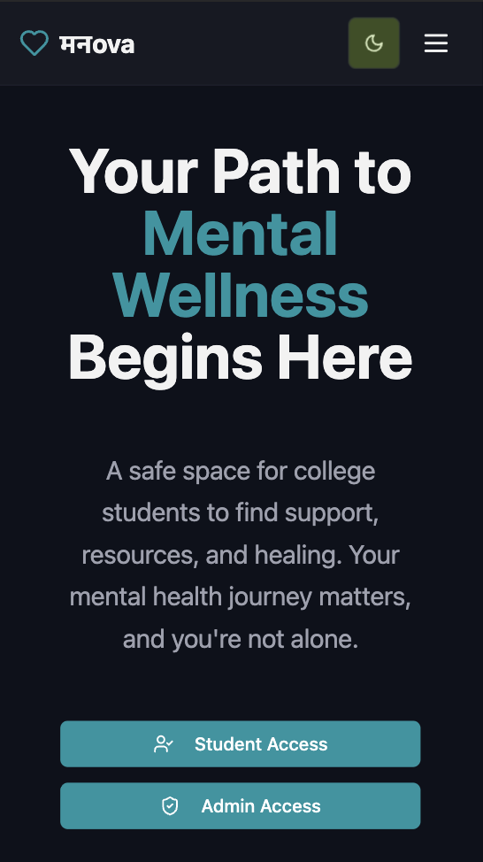
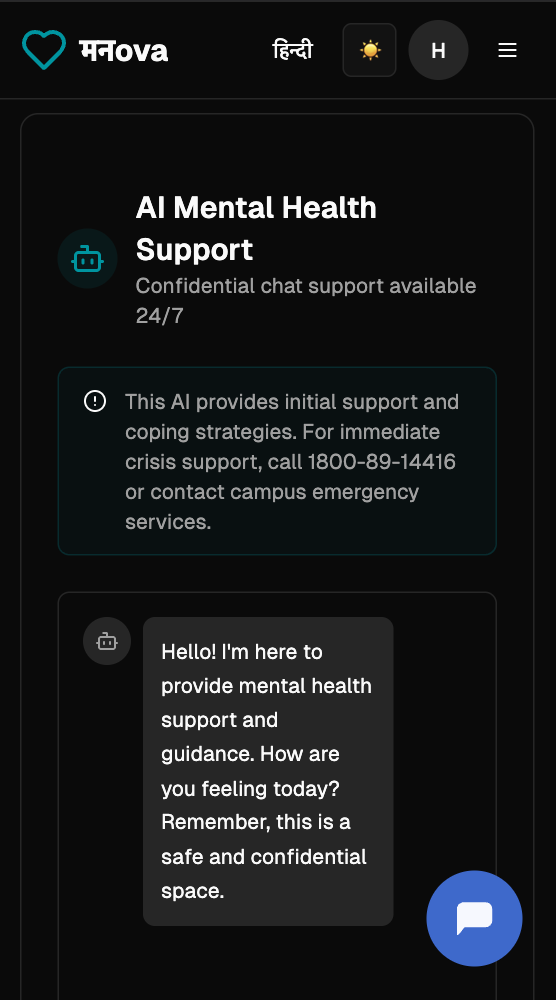
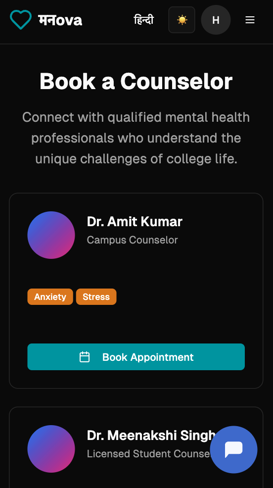
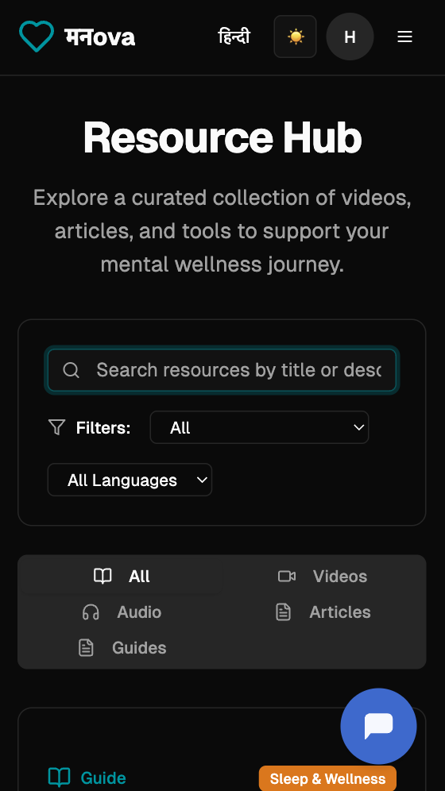
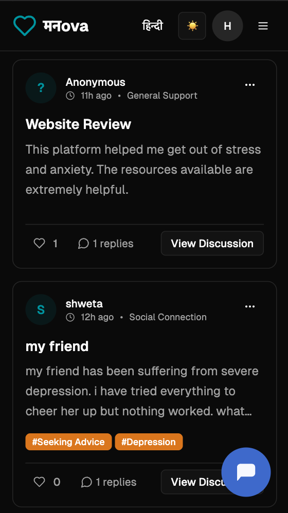
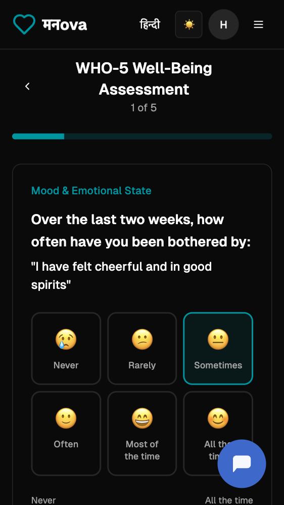
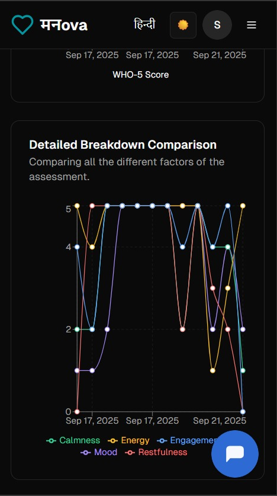
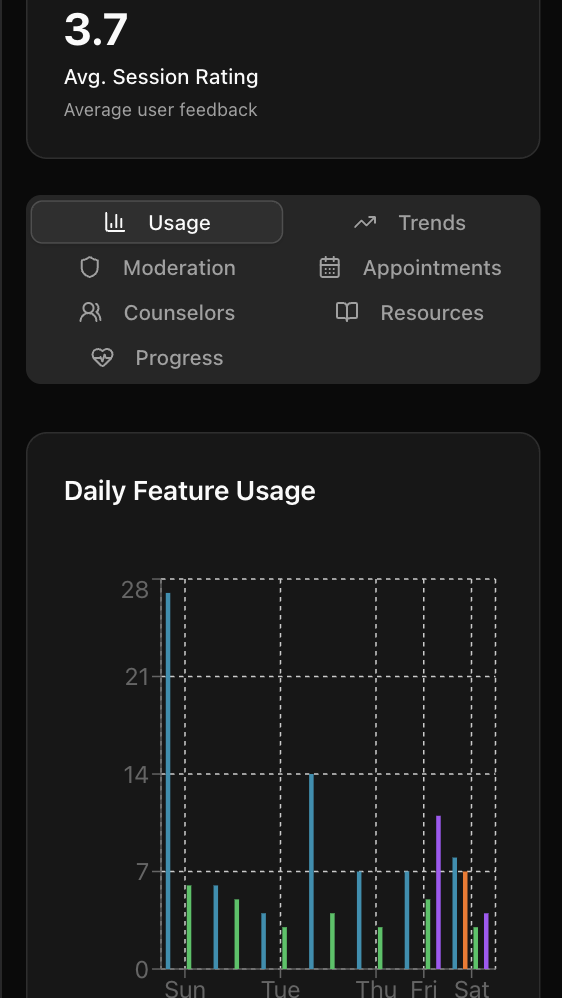

# मनova: A Digital Mental Health Platform for Students 🤝

मनova is a comprehensive web application designed to provide *innovative digital mental health and psychological support* for students in higher education. This platform tackles the critical need for *structured, accessible, and stigma-free* mental health services by offering a centralized hub for students and administrators alike. Built with modern web development technologies, it delivers a robust and scalable solution tailored to the unique needs of college communities.

---

## ✨ Key Features

### For Students 🧑‍🎓

- *AI-Guided Chatbot*: Get immediate mental health support and coping strategies powered by the [Groq LLM API](https://groq.com/docs/). 
    
- *Counselor Booking*: Easily book confidential appointments with on-campus counselors for in-person or virtual consultations via [Zoom's Video SDK](https://www.google.com/search?q=https://zoom.us/docs/en-us/zoom-video-sdk.html). 
    
- *Anonymous Peer Forum*: A moderated space for students to share feelings and support each other anonymously. Reporting tools ensure a safe environment for everyone. 
    
- *Resource Hub*: A curated section where colleges can provide psychoeducational resources like videos, articles, and audio in multiple languages. 
    
- *Progress Tracker*: Monitor your mental wellness journey through weekly psychological questionnaires (PHQ-9, GAD-7) and daily WHO-5 questions. 
    

### For Admins 👩‍💼

- *Dashboard*: A centralized hub with aggregated data and trends on student mental health within the institution. 
    
- *Moderation*: Tools to moderate, approve, or delete posts and replies on the peer forum, maintaining a safe and healthy community. 
    
- *Trend Analysis*: Utilize chatbot data to generate graphs of top issues students are facing, helping institutions address common problems proactively. 
    
- *Counselor Management*: Easily add new counselors and manage their appointments. 
    
- *Progress Section*: Displays anonymized, aggregate data from the student progress tracker, filterable by academic year and department. 
    

---

## 🛠 Tech Stack

### Technologies Used

- *Frontend*: [React](https://react.dev/), [TypeScript](https://www.typescriptlang.org/), [HTML](https://developer.mozilla.org/en-US/docs/Web/HTML), [CSS](https://developer.mozilla.org/en-US/docs/Web/CSS), [JavaScript](https://developer.mozilla.org/en-US/docs/Web/JavaScript)
    
- *Backend: **Firebase* for a scalable database and user authentication.
    
- *Chatbot: **Groq LLM API* powers the AI assistant.
    
- *Video Conferencing: **Zoom API* for seamless video calls.
    

### Libraries

- *ReCharts*: For creating beautiful charts and data visualizations. 📈
    
- *i18next*: For supporting a multilingual interface. 🌐
    
- *Tailwind CSS* & *Shadcn/ui*: For a sleek and modern user interface. 🎨
    
- *Lucide-React*: For high-quality, customizable icons. ✨
    

### Data Privacy 🔒

We prioritize student privacy. The system collects and aggregates all data anonymously. The admin dashboard only displays trends and statistics, such as total active users and forum posts, without ever showing individual student activities. Your privacy is our priority.

---

## 📸 Project Showcase

| Page                   | Description                                                                                        | Screenshot |
| ---------------------- | -------------------------------------------------------------------------------------------------- | ---------- |
| *Home Page*          | The main landing page introduces मनova and its mission.                                            |  |
| *Chat Support*       | The AI-guided chatbot provides instant support and coping strategies.                              |  |
| *Book Counselor*     | Students can easily book and manage confidential appointments with on-campus counselors.           |  |
| *Resources*          | A curated hub for psychoeducational resources like articles, videos, and audio.                    |  |
| *Peer Support*       | A safe, anonymous forum for students to connect and support each other.                            |  |
| *Assessment*         | A tool for students to track their mental wellness through psychological questionnaires.           |  |
| *Personal Analytics* | Students can view their progress and wellness trends over time.                                    |  |
| *Admin Dashboard*    | Administrators can view aggregate data and trends on student mental health within the institution. |  |

---

## 🧪 Testing & Demo Accounts

For testing and demonstration, you can use the following credentials.

### Student Account 📚

- *Email*: teststu1@gmail.com
    
- *Password*: teststu1
    
- *College ID*: CLG-LKN8XXKX7
    

### Admin Account 💼

- *Email*: test123456@gmail.com
    
- *Password*: 123456
    
- *College ID*: CLG-LKN8XXKX7
    

---

## 📜 License

This project is licensed under the *MIT License*.

---

## 👥 Members (Team CommitMints)

- [Yash Kumar](https://github.com/yashkumar181)
    
- [Simon Mittal](https://github.com/Simon-Mittal)
    
- [Shweta Kumari](https://github.com/shwetakkk21)
    
- [Tarun Sharma](https://github.com/TARUN-CO)
    
- [Atharva Kesharwani](https://github.com/Atharva-coder-2005)
    
- [Nikhil Nigam](https://github.com/nikhilnigam-135)
